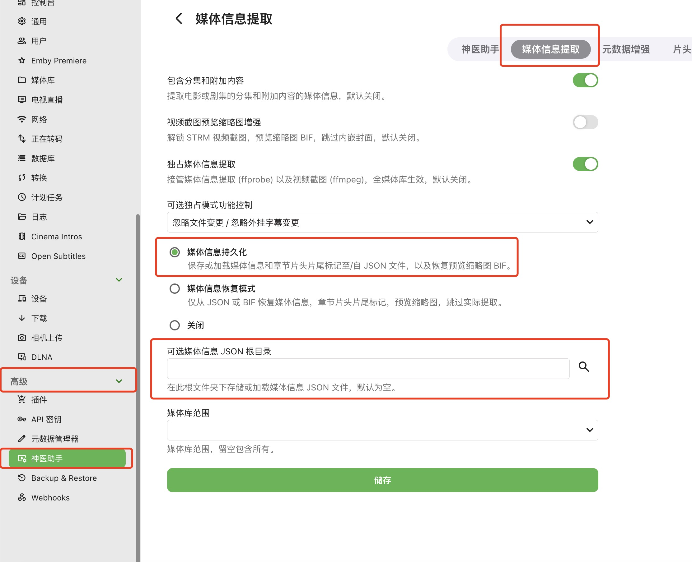

<p align="center">
  
</p>

# Ubuntu 安装 Emby 并挂载网盘远程播放指南 [非302]

## 准备条件

1. Ubuntu 24.04 LTS 服务器  
2. Emby 安装包  
3. OpenList 安装包  
4. alist-strm 安装包  

---

## 一、环境准备

### ✅ 建议使用 root 用户操作

```bash
sudo apt update
sudo apt install apt-transport-https ca-certificates curl software-properties-common
```

### 依赖说明

| 包名 | 说明 |
|------|------|
| `apt-transport-https` | 支持 apt 使用 HTTPS 协议 |
| `ca-certificates` | 安装根证书，验证 HTTPS 安全连接 |
| `curl` | 命令行网络工具，下载脚本常用 |
| `software-properties-common` | 提供 `add-apt-repository` 命令支持添加源 |

---

## 二、创建必要目录

> 📁 路径结构树形图
> 以下为安装与挂载路径的树形结构展示：
```
/root
├── docker
│   ├── openlist
│   │   └── data              # OpenList 配置文件
│   ├── emby
│   │   └── config            # Emby 配置文件
│   └── strm
│       ├── config            # alist-strm 配置文件
│       └── data              # alist-strm 数据目录
├── download                  # 安装包与镜像存放目录
└── video
    ├── music                 # 音乐文件挂载目录
    └── strm                  # .strm 流媒体挂载目录
```

```bash
mkdir -p \
/root/docker/openlist \
/root/docker/openlist/data \
/root/docker/emby \
/root/docker/emby/config \
/root/docker/strm \
/root/docker/strm/config \
/root/docker/strm/data \
/root/download \
/root/video \
/root/video/music \
/root/video/strm
```

---

## 三、安装 Docker

1. 前往 [Docker Ubuntu 软件包目录](https://download.docker.com/linux/ubuntu/dists/noble/pool/stable/amd64/) 下载以下 `.deb` 安装包：

> 💡 提示：按住 Ctrl（Windows）或 Cmd（macOS）点击链接，可在新标签页中打开。

   - `docker-ce`
   - `docker-ce-cli`
   - `containerd.io`
   - `docker-buildx-plugin`
   - `docker-compose-plugin`

2. 使用 SFTP 工具将 `.deb` 包上传到 `/root/download/`

3. 安装 Docker：

```bash
cd /root/download
sudo dpkg -i *.deb
```
> 如果出现依赖缺失，运行以下命令修复：
```
sudo apt-get install -f
```

4. 验证安装：

```bash
sudo systemctl status docker
docker -v
docker images
```
> 查询docker版本号码
> 
> docker -v
> 
> 查看docker中有什么镜像
> 
> docker images

---

## 四、下载并导入镜像（推荐在网络好的电脑完成）

> 这次教程的环境是 Ubuntu 24.04 LTS 服务器，架构是 amd64。在这种环境下，如果你用正常网络下载 Docker 镜像并导出，要注意一点：如果你用的是 ARM 电脑，默认拉下来的是 ARM 架构的镜像。要想在 amd64 服务器上部署，就得强制指定架构，强制拉取 amd64 版本的镜像，这样才能保证镜像能正常运行。

## 项目资源整理

###  Emby

- **Docker 镜像地址**：  
  [https://hub.docker.com/r/amilys/embyserver](https://hub.docker.com/r/amilys/embyserver)

---

###  alist-strm

- **GitHub 地址**：  
  [https://github.com/tefuirZ/alist-strm](https://github.com/tefuirZ/alist-strm)

- **Docker 镜像地址**：  
  [https://hub.docker.com/r/itefuir/alist-strm](https://hub.docker.com/r/itefuir/alist-strm)

---

###  OpenList

- **GitHub 地址**：  
  [https://github.com/OpenListTeam/openlist](https://github.com/OpenListTeam/openlist)

- **Docker 镜像地址**：  
  [https://hub.docker.com/r/openlistteam/openlist](https://hub.docker.com/r/openlistteam/openlist)


### 1. Emby 镜像

```bash
docker pull --platform=linux/amd64 amilys/embyserver:latest
docker inspect --format='{{.Architecture}}' amilys/embyserver:latest
docker save -o amilys-embyserver-amd64.tar amilys/embyserver:latest
```

### 2. Alist-strm 镜像

```bash
docker pull --platform=linux/amd64 itefuir/alist-strm:latest
docker inspect --format='{{.Architecture}}' itefuir/alist-strm:latest
docker save -o itefuir-alist-strm-amd64.tar itefuir/alist-strm:latest
```

### 3. OpenList 镜像

```bash
docker pull --platform=linux/amd64 openlistteam/openlist:latest
docker inspect --format='{{.Architecture}}' openlistteam/openlist:latest
docker save -o openlist-amd64.tar openlistteam/openlist:latest
```


### 4 如果需要将镜像导出为 .tar 文件并保存到指定路径，可以使用如下命令：

```bash
docker save -o /root/download/openlist-amd64.tar openlistteam/openlist:latest
```
> 使用 docker save 命令时，指定保存的路径和文件名（如 /路径/路径/文件名.tar），后面跟上要导出的镜像及版本（项目名称:版本号），即可将镜像导出到指定位置。

---

## 五、镜像导入服务器

> 使用 SFTP 工具将 `.tar ` 包上传到 `/root/download/`
> 
> 进入镜像存放目录
> 
> 镜像导入服务器
> 
> 并且导入镜像到服务器

```bash
cd /root/download
docker load -i amilys-embyserver-amd64.tar
docker load -i itefuir-alist-strm-amd64.tar
docker load -i openlist-amd64.tar
docker images
```

---

## 六、获取设备 UID / GID（用于容器权限）

```bash
id
```
>  示例输出：
>  uid=0(root) gid=0(root) groups=0(root)

---

## 七、运行容器

> 安装docker镜像到容器 命令介绍
> 
> docker run -d \
> 
> （docker 运行 创建容器）
> 
>   --name emby \
>   
> （创建容器名字为 emby） 
> 
>   -p 8096:8096 \
>   
>   (-p 内外端口映射设置)
>   
> （容器外部端口：容器内部端口）
> 
>   -p 8920:8920 \
>   
> （容器外部端口：容器内部端口） 
> 
>   -v /root/docker/emby/config/:/config \
>   
> （-v内外路径设置）
> 
> （外部路径：容器内部路径）
> 
>   -v /root/video/:/video \
>   
> （外部路径：容器内部路径）
> 
>   -e UID=0 \
>   
> （之前获取设备id的 UID号码）
> 
>   -e GID=0 \
>   
> （之前获取设备id的 GID号码）
> 
>  -e TZ=Asia/Shanghai \
>  
> （设置容器时区为亚洲上海时区） 
> 
> amilys/embyserver:latest
> 
> （使用（镜像名字）：版本）

### 1. 运行 Emby 容器

```bash
docker run -d \
  --name emby \
  -p 8096:8096 \
  -p 8920:8920 \
  -v /root/docker/emby/config/:/config \
  -v /root/video/:/video \
  -e UID=0 \
  -e GID=0 \
  -e TZ=Asia/Shanghai \
  amilys/embyserver:latest
```

> 浏览器访问：`http://服务器IP:8096`，首次设置语言、账号和密码。

---

### 2. 运行 OpenList 容器

```bash
docker run -d \
  --name=openlist \
  -v /root/docker/openlist/data/:/opt/openlist/data \
  -p 5244:5244 \
  -e PUID=0 \
  -e PGID=0 \
  -e UMASK=022 \
  openlistteam/openlist:latest
```

> 查看日志获取初始密码：

```bash
docker logs openlist
```

> 示例密码：`Successfully created the admin user... password is: 0p93Lr9V`  
> 示例密码：`password is: 0p93Lr9V`    这里 0p93Lr9V 就是初始密码 包含大小写 请复制
> 
> 浏览器访问：`http://服务器IP:5244`，账号：`admin`，密码：日志中的初始密码。

---

### 3. 运行 alist-strm 容器

```bash
docker run -d \
  --name alist-strm-container \
  -p 5000:5000 \
  -v /root/docker/strm/config/:/config \
  -v /root/docker/strm/data/:/data \
  -v /root/video/:/video \
  itefuir/alist-strm:latest
```

> 浏览器访问：`http://服务器IP:5000`，注册账号即可使用。

---

## 八、容器管理命令

- 停止容器：

```bash
docker stop emby
docker stop openlist
docker stop alist-strm-container
```

- 启动容器：

```bash
docker start emby
docker start openlist
docker start alist-strm-container
```

- 若想让这些容器在系统重启后自动启动
- 可使用 docker update 命令更新它们的重启策略，示例如下：

```bash
docker update --restart=always emby openlist alist-strm-container
```
> 上述命令会把这三个容器的重启策略设置为 always，意味着无论容器因何原因停止，Docker 都会尝试重新启动它，包括在系统重启之后。

---

## 九、升级容器镜像（以 alist-strm 为例）

### 1. 导入新镜像

```bash
docker load -i /root/download/itefuir-alist-strm-amd64.tar
```

### 2. 停止旧容器

```bash
docker stop alist-strm-container
```

### 3. 备份配置（可选）

```bash
cp -r /root/docker/strm/config/ /root/docker/strm/config_backup_$(date +%s)
```

### 4. 删除旧容器

```bash
docker rm alist-strm-container
```
> 注意：docker rm 只是删除容器实例，不会删除挂载在本地路径中的配置文件。只要新建容器时继续使用相同的挂载目录，原有的配置就会被自动加载，无需重新配置。

### 5. 重建容器（保持原端口配置）

```bash
docker run -d \
  --name alist-strm-container \
  -p 5000:5000 \
  -v /root/docker/strm/config/:/config \
  -v /root/docker/strm/data/:/data \
  -v /root/video/:/video \
  itefuir/alist-strm:latest
```

---

## 十、查看容器运行状态

```bash
docker ps -a
```

---

## 十一、软件内部设置  (仅供参考)
### 1.emby 
先对emby进行核心设置

1. emby 设置
2. emby 媒体库 设置
3. emby 子账号 权限 设置  
4. emby 神医助手 关键 设置 

#### 1.emby 设置
关闭emby 硬件加速功能
设置➡️Emby Server➡️正在转码

启动硬件加速(如果可以用) ✅否    (选择 否 ) 
 
<p align="center">
  
</p>

> 关闭硬件转码因为硬件转码需要高性能服务器

设置读取媒体信息生成  JSON  文件并保存到视频文件目录而不是 emby 容器内

设置➡️高级➡️神医助手➡️媒体信息提取
> 可选媒体信息  JSON  根目录  (就是单独给JSON文件设置一个目录)如果不填写该目录默认放到视频文件旁边

<p align="center">
  
</p>


#### 2.emby 媒体库 设置
设置媒体库权限

新增媒体库

| 名称 | 说明 |
|------|------|
| `影片` | 电影|
| `音乐` | 音乐 |
| `电视节目`  | 电视剧 |
| `混合内容` | 视频音乐图片书籍混合内容 |

<p align="center">
  
</p>

##(仅供参考设置截图)

### 1. 不管是电影还是电视剧请选择  TheMovieDb 下载元数据
### 2.  将媒体图片保存到媒体文件夹中  ✅开启
### 3.  将已下载的字幕保存到媒体文件夹中  ✅开启
### 4.  其他选项根据自己喜好选择

<p align="center">
  
</p>
<p align="center">
  
</p>
<p align="center">
  
</p>
<p align="center">
  
</p>
<p align="center">
  
</p>
<p align="center">
  
</p>

#### 3. emby 子账号 权限 设置 
关闭子账号 硬件转码权限

设置➡️Emby Server➡️相应用户名称➡️

允许媒体播放  ✅是

如有必要，在媒体播放期间允许音频转码  ✅否

如有必要，在媒体播放期间允许视频转码 ✅否

如有必要，在媒体播放期间允许更改容器格式 ✅否

<p align="center">
  
</p>

> #<span style="color:#00BFFF">关闭子账号硬件加速权限使用子账号播放视频</span>
> #<span style="color:#FF0000">不要使用管理员账号播放视频</span>
> #<span style="color:#FF0000">因为管理员默认开启硬件加速功能呢</span>

隐私权限 (仅供参考)

<p align="center">
  
</p>


### 2.OpenList

OpenList挂载教程

1. 前往 [OpenList 挂载网盘教程](https://oplist.org/zh/guide/) 
2. 前往 [OpenList-115 网盘/分享 挂载教程](https://oplist.org/zh/guide/drivers/115.html) 
3. 前往 [OpenList-123 网盘/分享/直链 挂载教程](https://oplist.org/zh/guide/drivers/123.html) 

<p align="center">
  
</p>


### 3.alist-strm

#### 设置➡️脚本全局设置➡️脚本设置

<p align="center">
  
</p>

#### 设置➡️创建strmの配置文件➡️添加新配置

<p align="center">
  
</p>

#### 设置➡️创建strmの配置文件   选择脚本 运行选定配置  右侧 可以查看脚本日志 

> 脚本一旦启动不能停止 除非docker停止或者重启


<p align="center">
  
</p>

<p align="center">
  
</p>


### 4.emby 媒体库 选择 strm 生成目录

<p align="center">
  
</p>

<p align="center">
  
</p>

<p align="center">
  
</p>

<p align="center">
  
</p>

<p align="center">
  
</p>

---
---
---

<p align="center">
  
</p>

---

感谢打赏

如有问题请在issues提问

<p align="center">
  
</p>


